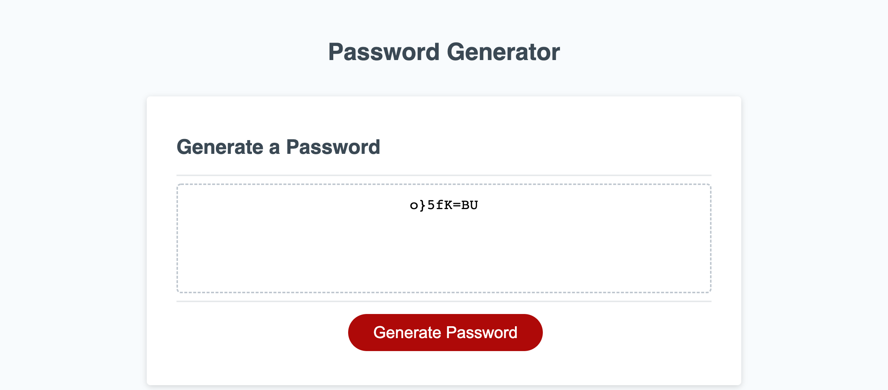

# Generating-Passwords-Challenge

## Description
When you click on the password generator button, the password generator starts out with prompts about the criteria the user wants to include in the password, for example, the first option is lowercase letters. The prompts end with how long you would like your passsword to be. After the prompts are all answered, the newly generated password appears on the application in the box.

## Screenshot
Here is a screenshot of my password generator with a random password that is 8 characters in length and includes lowercase, uppercase, numeric, and special characters.

## Deployed Link For Password Generator
Here is the link to my deployed application.

https://angelinarair33.github.io/Generating-Passwords-Challenge/